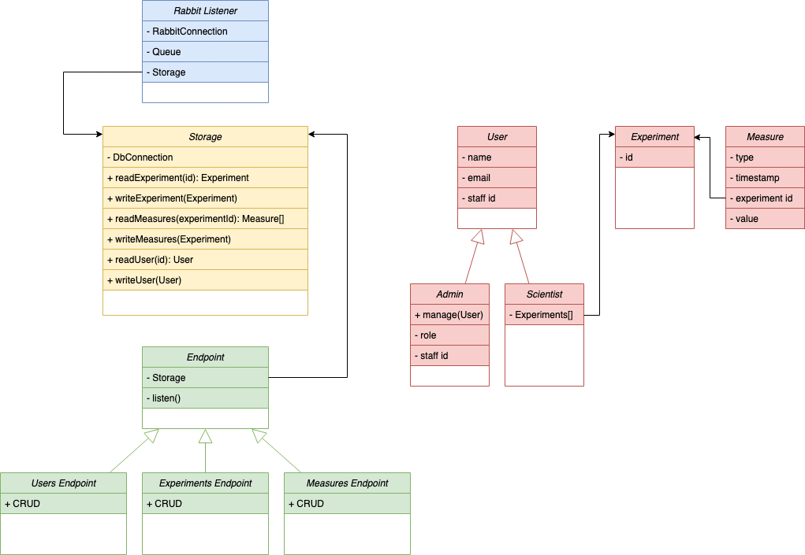

# Application Layer

The following diagram illustrates layers of the application and the interaction of the components.

There will be no direct interactions between the components consuming messages from the broker (in blue) and the components exposing REST endpoints (in green). The Storage (in yellow) will mediate the communications between the two parts.
