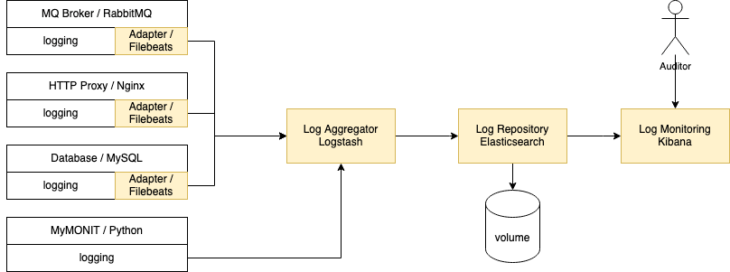

# Components

The solution comprises multiple components responsible for different aspects. The solution (in the blue area of the diagram) will interact with external data producers and users.

## Deployment

The entire solution will be containerized with Docker and orchestrated with Docker Compose. This choice makes it easier to deploy the solution in other platforms such as Kubernetes with minimal changes to the configuration. This strategy also aims to reduce the attack surface by hiding all the services that do not need to be reachable by the user.

## HTTP Input

An HTTP proxy is responsible for encrypting the communications with the solution, offloading the incoming encryption, and adding encryption to the output. All HTTP-based communication will flow through the proxy hiding the corresponding services.

For this purpose, the implementation will use Nginx, which could also implement load-balancing functions should it be necessary to scale the application with additional nodes.

## Data Streams

An MQ Broker will expose queues to accept data streams from the experiments.

RabbitMQ is one of the most popular tools on the market for this particular need. RabbiMQ supports TLS to encrypt communications and clustering to address scalability issues.

## Storage

A database is responsible for the storage of the application's data. Being the model of the data known, a SQL Database represents a simple solution. Further expansions could consider moving the experiments' data to a NoSQL database that may offer better scalability.

There are no special requirements to guide the choice of a product. MySQL will be the initial choice. The application's design will ensure a level of abstraction to minimize the impact of a change should new insights suggest a different product would be a better fit.

## Safe Repository

Safe Repository is the core component responsible for storing Hadron Collider's experimental data. It will expose multiple HTTP endpoints to configure the application resources and will process parallel data streams through input queues. The application stores the information on an external database. Safe Repository will not be exposed directly to outside traffic.

Safe Repository will be implemented in Python using Flask to expose REST APIs and Pika to process MQ Queues.

## Filesystem encryption

Filesystem encryption can be used to host the filesystems of the storage and the broker. This configuration is transparent for the solution.

## Logging and Monitoring

All services will forward their logs to a centralized log aggregator responsible for the parsing and storage into a database. The logs will be visible in a dashboard exposed through the HTTP proxy.

This requirement will be implemented with the ELK Stack. Except for Safe Repository, all services will include Filebeats to forward their logs to Logstash. Safe Repository will send the logs directly to Logstash instead. Logstash will be responsible for the parsing and the storage in Elasticsearch. Kibana will expose a dashboard to let users monitor the functioning of the whole system.

[diagram source](components.drawio)
