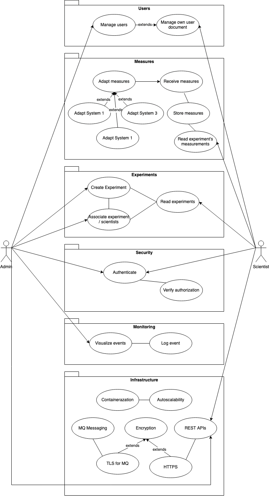

# High level solution

CERN uses a variety of independendly developed systems to monitor its intrastructure (Aimar et al., 2019). MyMONIT will be a solution to unify the monitoring of experiments into a single software. MyMONIT will integrate different streams of measurements to centralize this information.

An adapter will be installed in each source to normalize and deliver the measurement to a Message Broker. Measurements will be stored by MyMONIT into a database and made available through a REST interface.

MyMONIT will be scalable to ensure that it can cope with the increasing demand. The solution will also include monitoring to detect anomalies in the system and in the flow of the measurements.

