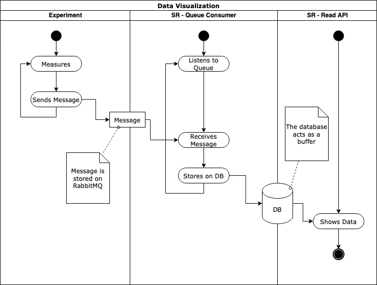

# Usage

The following diagrams illustrate the flow of information in the application.

The component performing measurements (out of scope) will send measures to the application's input queue.

A thread in Safe Repository will be responsible for reading the messages and storing their content on the Database.

Safe Repository's APIs will display the content of the database on demand.

From a timeline perspective, repeated calls to the APIs will return more results as more data is inserted into the database.

