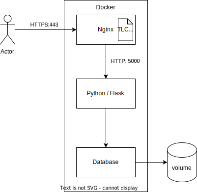

# Microservices

The solution is composed of microservices, each one with specific responsibilities. The microservices are packaged into Docker Containers, and Docker Compose is responsible for their orchestration. The customer can customize the deployment in any compatible platform, including the most common cloud-based Kubernetes clusters.

## Safe Repository

The principal service is "Safe-Repository" written in Python and Flask and exposing REST APIs. Its responsibility is the implementation of the business logic of the solution. The customer's preferences guided the choice of the technology.

## Database

A database is responsible for the storage of the data. The database will be SQL/NoSQL (TBD) based on the following criteria:
* TBD
* TBD

The database requires a persistent volume for the data. The secrets will be managed by TBD.

## Nginx

An Nginx proxy is responsible for encrypting the communication between Safe-Repository and the clients. The Nginx node will host the TLS certificates and offload the encryption. The popularity and versatility of Nginx for such applications lead to the choice (Lei et al., 2020).

[deployment diagram source](microservices.drawio) (editable on [app.diagrams.net/](https://app.diagrams.net/))

## References

Lei, Z., Zhou, H., Ye, S., Hu, W., & Liu, G. P. (2020). Cost-effective server-side re-deployment for web-based online laboratories using NGINX reverse proxy. IFAC-PapersOnLine, 53(2), 17204-17209. Available from https://ifatwww.et.uni-magdeburg.de/ifac2020/media/pdfs/0844.pdf [Accessed: 14/03/2022]
